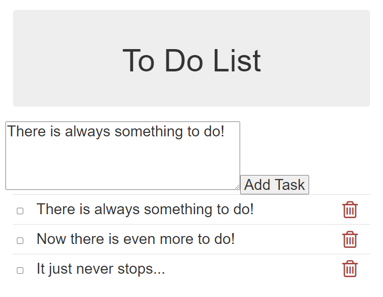

# ToDoApp


## Prerequisites
* Angular
* nodeJs
* .NET Core 5

## Getting started

### Back End

```bash
cd ToDoAPI
dotnet restore
dotnet build
dotnet run
```
open [Swagger page](http://localhost:5000/swagger/index.html)

### Front End

```bash
cd ToDoApp
npm install -g @angular/cli
ng install --save-dev @angular-devkit/build-angular
ng build
ng serve
```
open [main page](http://localhost:4200/)

## Further Work

### ToDoApp
* front-end unit tests
* tidy up UI styling

### ToDoAPI
* back-end unit tests
* refactor to inject singleton datastore
* make datastore thread safe
